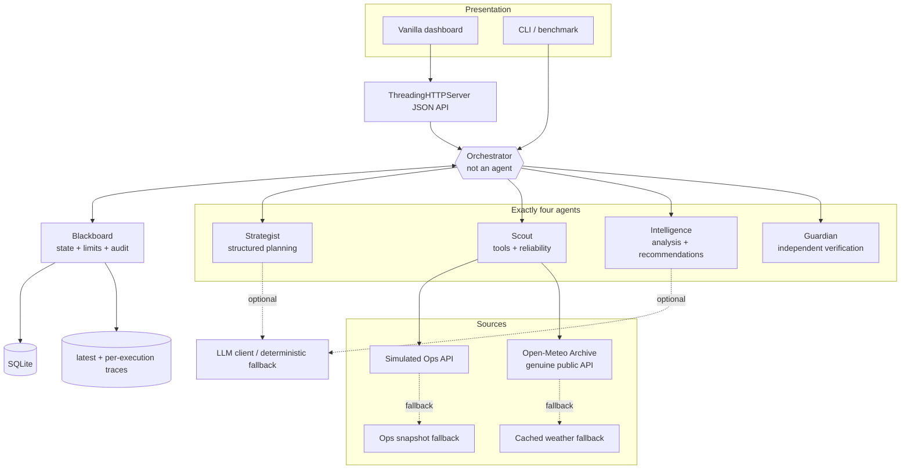
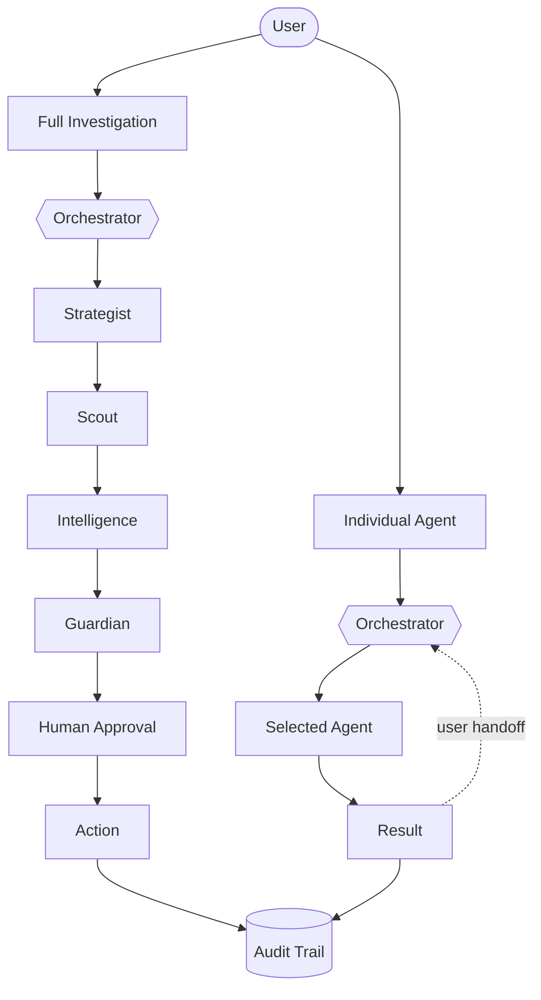
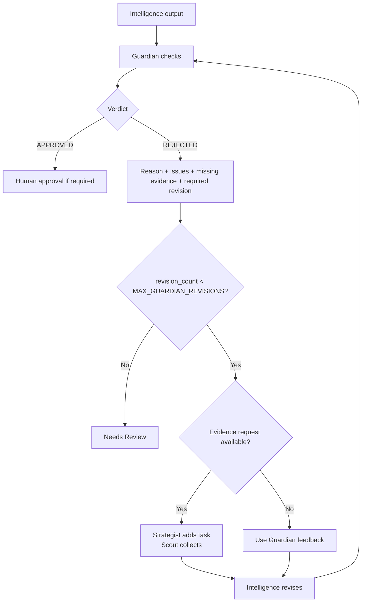
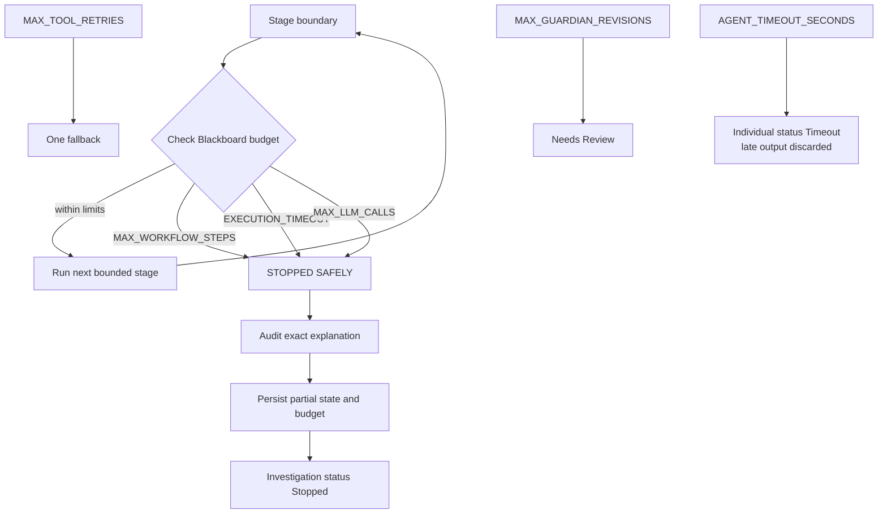
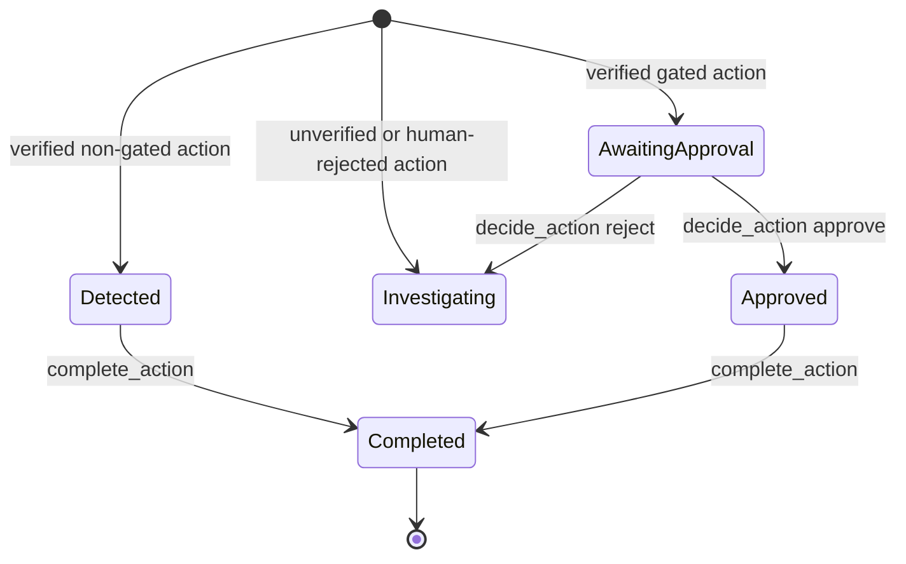
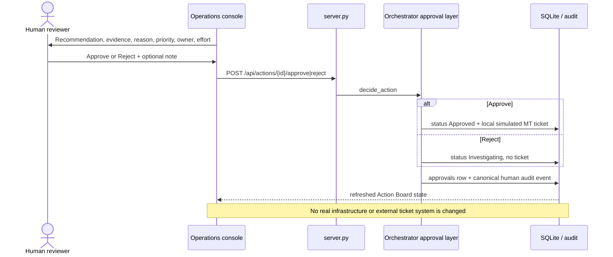
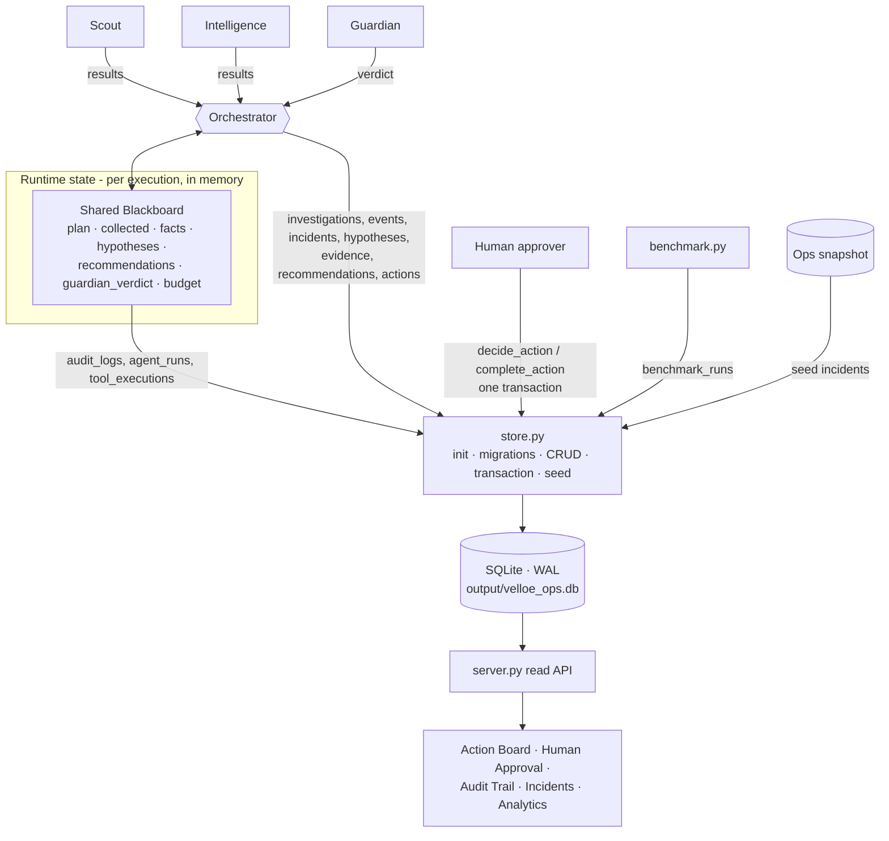
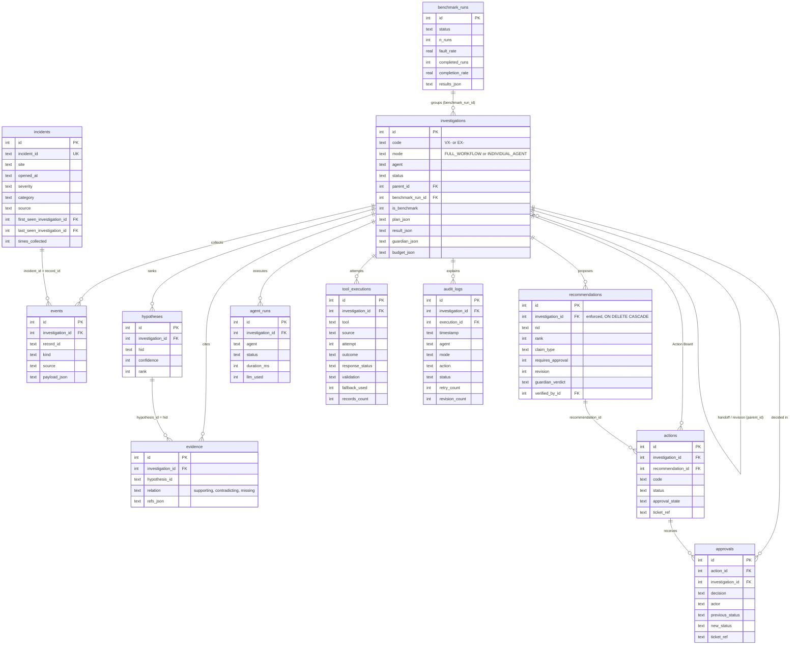
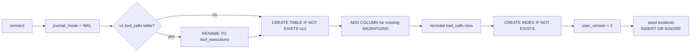
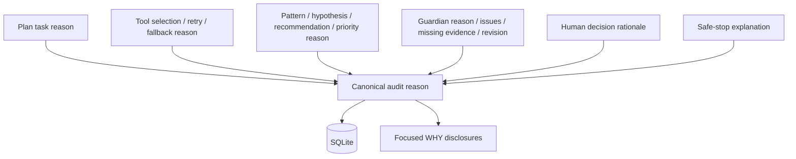

# Architecture — Velloe Ops Intelligence

Velloe Ops Intelligence contains exactly four specialized agents coordinated by a non-agent Orchestrator. It supports a primary full workflow and isolated individual-agent executions with explicit user handoffs. Blackboard carries per-execution state and stopping budgets; SQLite is the durable record; `requests` is the only required third-party runtime dependency.

## 1. Components



## 2. Execution modes

### Full workflow

`DETECT → PLAN → COLLECT → ANALYZE → INVESTIGATE → VERIFY → RECOMMEND → HUMAN APPROVAL → ACTION → AUDIT`

The Orchestrator automatically delegates across the four agents. Guardian may trigger bounded evidence collection and Intelligence revision. Only Guardian-approved consequential recommendations reach `Awaiting Approval`.

### Individual agent

`run_agent()` executes one selected agent under the same validation, policy, timeout, budget, persistence, and audit layer. It never silently invokes another agent. A user can explicitly hand off Strategist → Scout → Intelligence → Guardian, Guardian → Intelligence revision, or approved Guardian output → action creation.

The agents are modular and can execute independently when a task does not require the complete multi-agent workflow. Individual execution still passes through the orchestration layer so reliability, tool policies, execution limits and auditability remain enforced.



**Why the orchestrator stays involved in individual mode.** Skipping agents must not skip controls. `run_agent()` does the following for every single-agent execution:

| Control | Implementation |
|---|---|
| Validation | `_validate()`: agent ID, allowed simulation mode per agent, task and context size limits, site/date/source checks, handoff source type |
| Tool policy | `AGENT_POLICY`: only Scout may call tools (incidents, telemetry, maintenance, weather); others have none |
| Retry / timeout / fallback | Scout's existing `_resilient()` contract, unchanged |
| Execution deadline | Agent runs in a worker thread; `future.result(timeout=AGENT_TIMEOUT_SECONDS)` → status `Timeout`, late output discarded and marked |
| Budget | Same Blackboard step/time/LLM-call limits → `Budget Reached` |
| Audit | `execution_start` … `execution_complete`, every entry with `mode`, `tool`, `retry`, `fallback_used`, `budget_pct` |
| Human approval | `create_actions()` only from a Guardian-APPROVED Intelligence result; gated actions start `Awaiting Approval`; `decide_action()` is the only path to a ticket |

Execution statuses: `Running`, `Completed`, `Degraded`, `Insufficient Data`, `Failed`, `Timeout`, `Budget Reached`, `Validation Failed`.

Handoffs (`available_handoffs()` / `prepare_handoff()`) are offered only on finished executions, always write a `handoff` audit event, and start exactly one new execution with `parent_id` pointing back, so the lineage is visible.

## 3. Full-workflow sequence

```mermaid
sequenceDiagram
    autonumber
    actor U as Operator
    participant O as Orchestrator
    participant B as Blackboard
    participant S as Strategist
    participant C as Scout
    participant I as Intelligence
    participant G as Guardian
    participant D as SQLite

    U->>O: request + simulator mode
    O->>B: DETECT
    O->>S: plan(request)
    S-->>O: objective, steps, ordered tool tasks, risks
    O->>B: PLAN state
    loop each task
      O->>C: collect(task, plan)
      C-->>O: normalized records + transport/validation metadata
      O->>B: collected events and evidence IDs
      B->>D: tool attempts and audit rows
    end
    O->>I: analyze(plan, collected)
    I-->>O: FACT / EVIDENCE / HYPOTHESIS / RECOMMENDATION
    O->>G: independent review
    alt APPROVED
      G-->>O: approval + checks
    else REJECTED and revision available
      G-->>O: reason, issues, missing evidence, required revision
      opt obtainable evidence
        O->>S: add_tasks(evidence requests)
        O->>C: collect additional evidence
      end
      O->>I: revise with feedback
      O->>G: re-review
    else revision limit reached
      O->>D: Needs Review; no gated action
    end
    O->>D: persist result, actions, verdict, audit
    O-->>U: final state / approval queue
```

## 4. Scout and genuine external API

`tools/weather_tool.py` calls the public Open-Meteo Archive endpoint with no key:

```text
https://archive-api.open-meteo.com/v1/archive
```

Allowlisted request metadata includes method, endpoint, site, latitude/longitude, date range, requested daily variables, and timezone. The real transport result is wrapped with HTTP status and body. `normalize()` then validates the Open-Meteo daily object and equal-length arrays before emitting weather records.

Raw bodies and credentials are not written to audit. Audit receives request metadata, response/classification status, validation state, and a bounded normalized summary containing count and evidence IDs.

### Tool failure recovery

```mermaid
flowchart TD
    T[Tool task] --> P[Primary call under caller deadline]
    P --> V{Response validates?}
    V -->|Yes| N[Normalize and scope]
    V -->|HTTP 500 / 429| F[Classify + audit]
    V -->|timeout / connection| F
    V -->|malformed JSON / schema / no data| F
    F --> R{retry_count < MAX_TOOL_RETRIES?}
    R -->|Yes| W[Bounded backoff<br/>clamped Retry-After for 429]
    W --> P
    R -->|No| B[Fallback call once]
    B --> BV{Fallback validates?}
    BV -->|Yes| D[status=degraded_fallback]
    BV -->|No| X[status=failed<br/>records=[]]
    N --> C[Continue]
    D --> C
    X --> C
```

Failure classifications are `http_500`, `http_429`, `timeout`, `connection_error`, `malformed_response`, `unexpected_schema`, `no_data`, and generic `error`. `NoDataError` means the envelope/schema was valid but no usable record existed. It is not treated as a fake successful response.

`MAX_TOOL_RETRIES=2` means at most three primary attempts. `SCOUT_MAX_ATTEMPTS=3` is the legacy equivalent and includes the first attempt. A 429 `Retry-After` value is honored only after clamping to a maximum of two seconds, keeping retries bounded.

Python threads cannot be force-killed. `Future.result(timeout=...)` is a caller deadline; the caller discards late output.

## 5. Failure simulator

`tools/faults.py` supports exact dashboard controls:

| Mode | Injected behavior |
|---|---|
| Normal | no fault |
| API 500 | every allowed primary attempt receives 500, then fallback |
| Timeout | every primary attempt exceeds/raises the caller deadline, then fallback |
| Malformed Response | malformed JSON/HTML, then fallback |
| No Data | valid empty source responses, then fallback |

Additional advanced modes cover primary-plus-fallback outage, hallucinated citation, and causal overclaim. Internal specs also support 429 and unexpected-schema tests. Legacy `none` and `api500` inputs map to current values.

## 6. Intelligence contract and recurrence

Full and operator-record analysis return:

- problem and impact
- `facts` where every item has `claim_type: FACT`
- `evidence` where every item has `claim_type: EVIDENCE`, relation, statement, and refs
- `hypotheses` where every item has `claim_type: HYPOTHESIS`, confidence, supporting, contradicting, and missing evidence
- `recommendations`/`actions` where every item has `claim_type: RECOMMENDATION`, action, priority, owner, effort, evidence, approval requirement, and optional automation opportunity
- timeline, risks, unknowns, source status, and evidence chain

Confidence remains a bounded evidence-weight score rather than probability:

```text
clamp(20 + 15·strong_support + 10·moderate_support
         - 20·strong_contradiction - 10·moderate_contradiction
         - 5·missing, 5, 90), rounded to 5
```

Recurring detection groups evidence by dimensions before reporting:

- `(site, sensor)` thermal episodes and time bands
- `(site, incident category, month)` incident recurrence
- category recurrence across sites
- equipment identifiers repeated across incidents
- `(site, asset)` maintenance recurrence
- telemetry/incident time proximity

Every recurrence/correlation statement explicitly avoids claiming root cause. Hypotheses remain separate and require direct evidence for higher confidence.

## 7. Guardian contract

Guardian is deterministic and independent from the optional LLM. Canonical output:

```text
verdict: APPROVED | REJECTED
reason
issues[]
missing_evidence[]
required_revision[]
```

Backward-compatible `reasons`, `checks`, `evidence_requests`, `unsupported_claims`, and `risk` remain.

Structured checks include claim separation, evidence existence, hypothesis support, citations, overclaiming, correlation-versus-causation wording, contradiction weighting, confidence for corrective actions, action completeness, recommendation approval safety, obtainable key evidence, degraded-source disclosure, and normalized field-gap disclosure.

Free-text review additionally checks direct diagnostic support, sample size, source reliability, and cited records.

### Guardian rejection/revision



The deterministic acceptance case “The UPS is definitely defective” with only correlated warning timestamps is rejected by certainty, correlation/causation, sample-size, and direct-diagnostic-support checks. Direct UPS diagnostics or measurements are listed as missing.

## 8. Stopping conditions



| Canonical name | Default | Legacy alias | Semantics |
|---|---:|---|---|
| `MAX_WORKFLOW_STEPS` | 120 | `MAX_STEPS` | audit-entry workflow budget |
| `EXECUTION_TIMEOUT` | 300 seconds | `MAX_SECONDS` | wall-clock workflow budget checked before/after bounded stages |
| `MAX_TOOL_RETRIES` | 2 | `SCOUT_MAX_ATTEMPTS=3` | retries after first primary attempt |
| `MAX_GUARDIAN_REVISIONS` | 2 | `MAX_REVISIONS` | revisions after initial Guardian review |
| `MAX_LLM_CALLS` | 12 | — | real provider attempts only |
| `AGENT_TIMEOUT_SECONDS` | 60 seconds | — | one individual execution caller deadline |

A whole-workflow breach stores `Stopped` plus an error/audit explanation beginning `STOPPED SAFELY`; tool exhaustion uses fallback/degradation, while Guardian exhaustion yields `Needs Review`.

## 9. Action lifecycle

The Action Board is a Kanban/table hybrid over the same `/api/actions` projection. Site is joined from the source investigation/execution; recommendation, owner, effort, evidence count, automation opportunity, approval state, ticket, and source link remain visible.



For individual handoffs, `create_actions()` now updates the approved Guardian execution to `Awaiting Approval` when any gated action exists, or `Approved` when all actions are non-gated.

## 10. Human approval



Only actions in `Awaiting Approval` can be decided. Approved and non-gated Detected actions can be marked Completed; double approval and completion that bypasses approval are rejected.

## 11. Audit model

Every Blackboard audit event records both canonical and legacy names:

| Canonical | Legacy/relationship |
|---|---|
| `timestamp` | `ts` |
| `execution_id` | `investigation_id` |
| `retry_count` | `retry` |
| `revision_count` | investigation `revisions` at completion |
| `agent`, `mode`, `action`, `tool`, `status`, `reason`, `duration_ms`, `fallback_used` | same/current fields |
| `request_json`, `response_status`, `validation`, `normalized_result_json` | detailed tool reliability metadata |

The migration layer adds columns to existing SQLite databases. Human approval events use the same execution and revision fields. `tool_executions` (formerly `tool_calls`, which remains as a read-only view) is the compact per-attempt operational table; `audit_logs` is the explanatory decision ledger.

`server.audit()` composes allowlisted filters for agent, mode, investigation ID, execution ID, status, failure/recovery event class, inclusive date range, and bounded text search. The Audit UI exposes those controls and expands each row to full timestamp, retry/revision/fallback/budget metadata, reason/input/output, safe request JSON, response status, validation, and normalized result.

The full database design is in section 12.

## 12. Database architecture (SQLite schema v2)

`store.py` is the single persistence layer (stdlib `sqlite3`). The Shared Blackboard remains the runtime state of a running execution; SQLite is the durable record written as the run progresses (audit rows and agent/tool runs immediately, analysis and actions at the end of a stage, approvals when a human decides).

### Write path



### Entity relationships



Only `recommendations.investigation_id` is an enforced constraint (connections set `PRAGMA foreign_keys = ON`). The other relationships are indexed ID columns, because SQLite cannot add constraints to existing tables without rebuilding them. `tool_calls` is a read-only compatibility view over `tool_executions`.

### Migration and init

`store.init()` is idempotent and runs on server start, on each Orchestrator construction (once per process per DB path), and from `python store.py`:



### Transactions

`store.transaction()` opens `BEGIN IMMEDIATE` and yields a `Tx` with the same `insert/update/one/query` interface as the module. `decide_action()` re-reads the action, applies a compare-and-set `UPDATE … WHERE status = 'Awaiting Approval'`, inserts the `approvals` row and the human audit row, and refreshes the investigation status inside one transaction; any failure rolls all of it back. `complete_action()` and `create_actions()` use the same mechanism.

## 13. HTTP/API surface

- Full investigations: `POST /api/investigations`, list/detail endpoints (detail includes `recommendations`, `approvals`, and `tool_calls` rows from `tool_executions`), more-evidence endpoint
- Individual execution: `POST /api/agents/{agent}/run`, execution detail/list, explicit handoff
- Actions: list, approve, reject, complete; `GET /api/approvals` approval history
- Incidents: `GET /api/incidents` from the SQLite catalog with linked investigations
- Benchmarks: `GET /api/benchmarks`; `/api/analytics` includes the latest benchmark run
- Database: `GET /api/database` returns schema version, journal mode, and row counts
- Audit/overview/analytics/agents/settings endpoints
- Failure options are served from `UI_FAILURES`, so the UI and server validate the same modes

## 14. Explainability and exact Site A power integration

The WHY system projects existing structured reasons; it is not a fifth agent or duplicate persistence service. Strategist task reasons, Scout selection/recovery reasons, Intelligence evidence plus recommendation/priority reasons, Guardian verdict/revision reasons, human decision rationale, and safe-stop explanations flow through result JSON and normalized SQLite fields into API/UI disclosures.



Action and recommendation rows include `reason`, `priority_reason`, `approval_reason`, `expected_impact`, `risk`, and `missing_evidence_json`. Scout source results include `selection_reason`. Intelligence includes `evidence_assessment` with available evidence, known facts, uncertainty, and recommended next evidence. Guardian rejects vacuous no-evidence output through `evidence_sufficient`.

The exact judge request uses simulated Site A records `INC-1050`, `INC-1051`, `INC-1052`, and revision evidence `MNT-304`. The initial plan collects incidents and genuine Open-Meteo context. The configured incident fault sequence reaches snapshot fallback. Guardian rejects the initial 50% upstream-power hypothesis because obtainable UPS diagnostics are missing. Maintenance collection adds a passed UPS self-test and utility-undervoltage input logs; Intelligence raises the upstream-power evidence score to 70%, contradicts the internal UPS-fault alternative, and emits a High approval-gated action.

## 15. Verification

On 2026-09-26:

```text
python -m unittest discover -s tests -v
Ran 69 tests in 122.099s
OK
```

`TestSQLitePersistence` covers schema v2 and seeding, in-place v1 → v2 migration without data loss, full-workflow persistence and cross-table links, approval rollback on failure, individual-chain recommendation/verdict/action links, benchmark storage, and read-back from a separate Python process. Two consecutive `server.py` processes on one database file also returned the same investigation, approved action, simulated ticket, and table row counts.

The real API normal-path test mocks HTTP with a representative Open-Meteo response, verifying the actual response schema and request parameters without making the suite network-dependent. The suite also covers the exact Site A power flow, WHY continuity, explicit insufficient evidence, deterministic benchmark expectations, 500, 429, timeout, connection outage, malformed JSON, unexpected schema, no data, retry/fallback/failure, all four individual agents, isolation, explicit handoffs, Guardian rejection/revision/revision limit, action creation/approval, full workflow, workflow and individual timeout, canonical audit columns, persistence restart, Action Board, Audit UI, analytics, themes, and responsive contracts. `node --check web/app.js` passes. The deterministic benchmark passed 8/8 scenarios. A fresh localhost server returned HTTP 200 for HTML, JavaScript, Overview, Investigations, Actions, Agents, Audit, Analytics, Incidents, Settings, and Database APIs; exact full and individual Intelligence→Guardian HTTP flows also passed.

## 16. Known limitations

No authentication/RBAC; simulated Ops records; caller deadlines cannot kill threads; deterministic Guardian is not formal semantic entailment; global thresholds/correlation windows; same-ID more-evidence runs replace derived rows (including recommendations and actions, leaving earlier approvals pointing at deleted action IDs); only `recommendations` has an enforced foreign key; approval actors remain unauthenticated demo identities even though state transitions are transactional.
