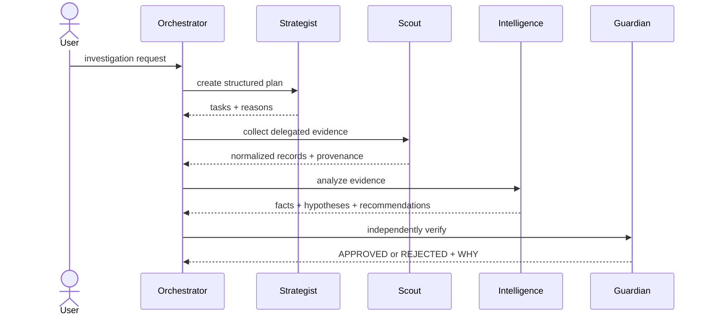
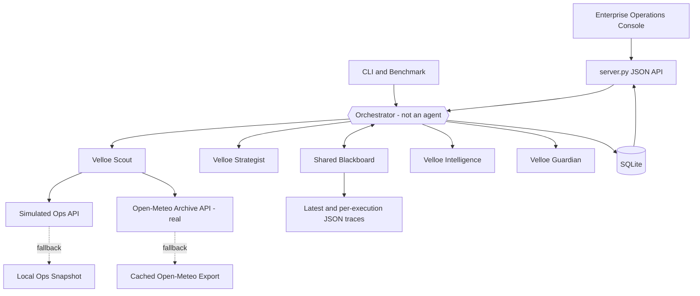
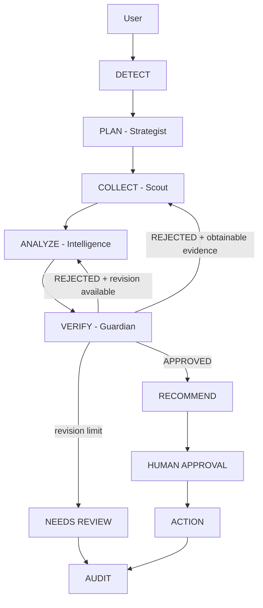
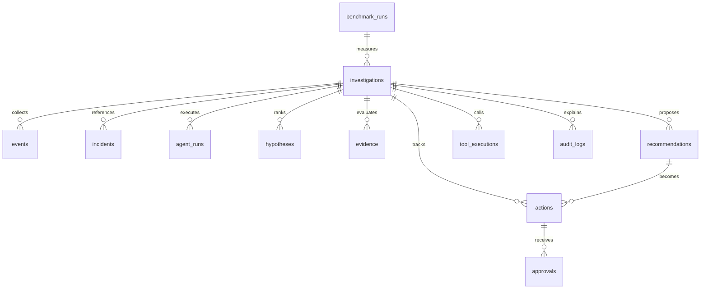
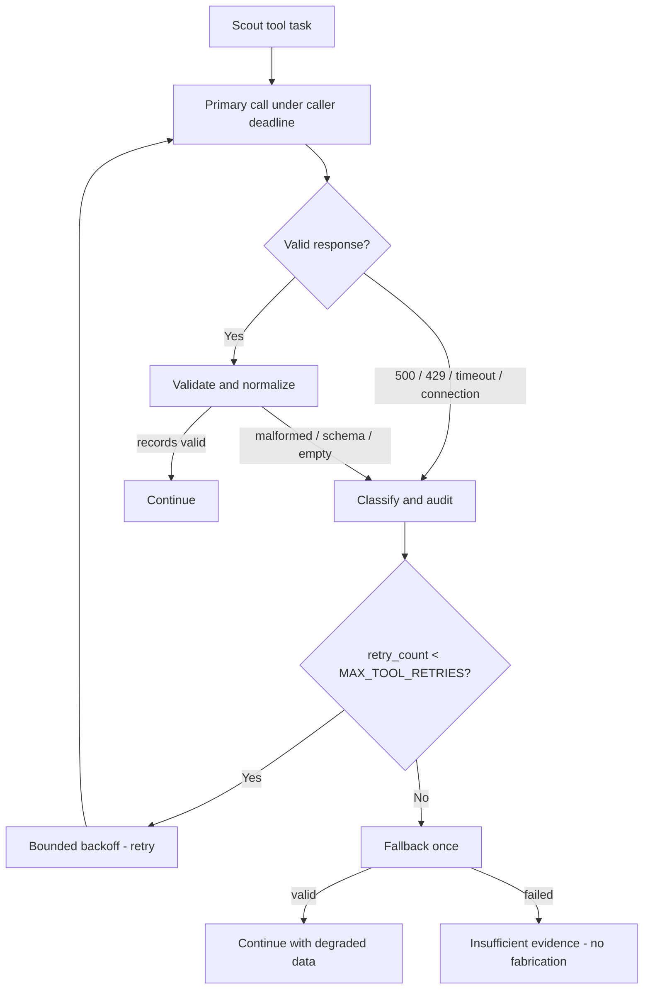
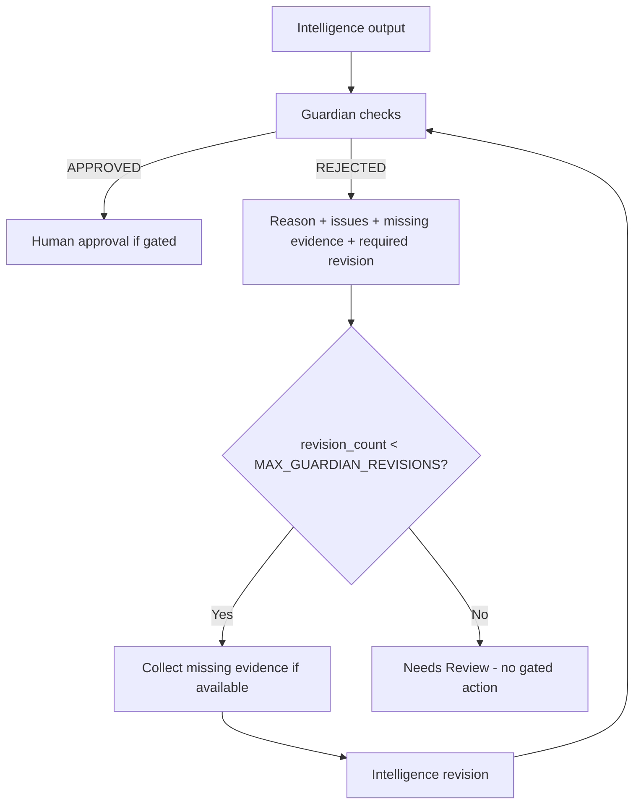
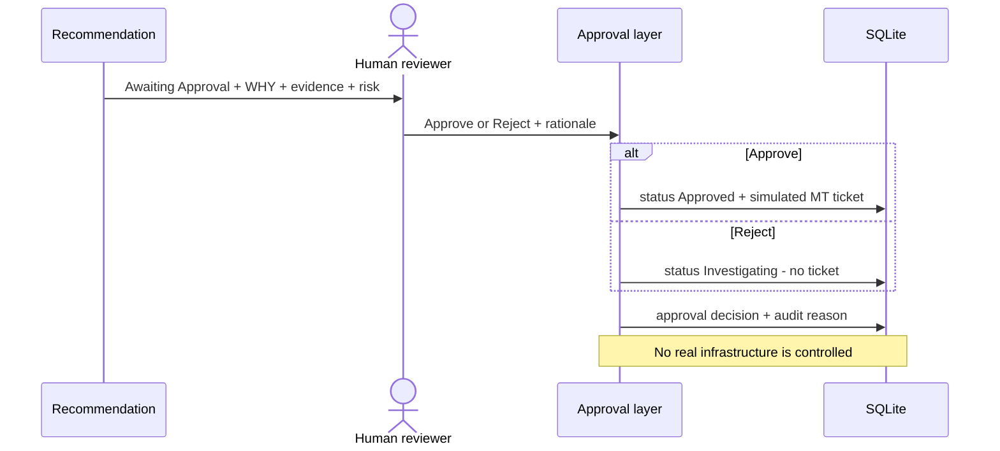
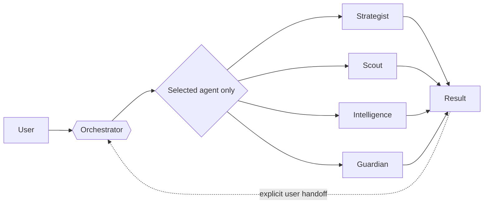
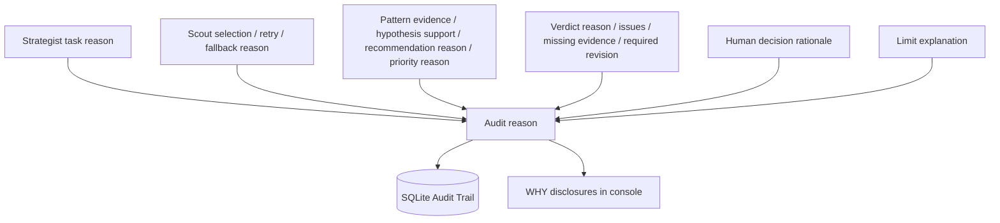

# Velloe Ops Intelligence

> A fault-tolerant multi-agent operational intelligence system that converts complex infrastructure events into evidence-backed insights, recommended actions, and auditable decisions.

Velloe Ops Intelligence is a hackathon MVP, not an official Velloe product. Sites, incidents, telemetry, maintenance records, benchmark outcomes, and tickets are explicitly simulated. Open-Meteo is the genuine public external API.

## Problem

Operational incidents span disconnected data sources and uncertain evidence. APIs fail, related events can be mistaken for causes, recommendations can be unsafe, and teams need to understand both **what** the system decided and **why**. A credible MVP must recover from failures, distinguish fact from hypothesis, reject unsupported conclusions, require a human before tracked operational action, and preserve an audit trail.

## Solution

The system uses exactly four specialized agents coordinated by a non-agent Orchestrator. A shared Blackboard carries live investigation state; Scout uses resilient tools; Intelligence produces typed facts, evidence, hypotheses, and recommendations; Guardian independently verifies them; SQLite persists every durable entity; and the enterprise operations console exposes workflow, WHY explanations, approval, Action Board, Audit Trail, and analytics.

The primary verified demo asks:

> **Why are repeated power fluctuations happening at Site A, and what should we do?**

The evidence supports an upstream power-quality hypothesis affecting `UPS-A1`; it does **not** prove that the UPS is defective.

## Why Multi-Agent?

A single model would mix planning, tool use, analysis, and self-review. Separation makes responsibilities and failures visible:

- Strategist determines what evidence is needed and delegates tasks.
- Scout owns external calls, validation, normalization, retries, and fallback.
- Intelligence separates observations from competing explanations and actions.
- Guardian independently rejects weak claims and unsafe recommendations.
- Orchestrator enforces order, limits, shared state, persistence, revisions, and approval.



## Architecture



Backend: Python standard library plus pinned `requests`. Frontend: vanilla HTML/CSS/JavaScript with no build step. Database: one SQLite file in WAL mode.

## Four Agents

| Agent | Distinct responsibility | Verified output |
|---|---|---|
| **Velloe Strategist** | Planning & Delegation | Objective, domain, site/window, steps, required data, ordered Scout tasks, task reasons, risks, delegation |
| **Velloe Scout** | Data & Tool Intelligence | Source selection reason, request/status, validation, normalized records, retries, fallback, errors, missing fields |
| **Velloe Intelligence** | Analysis & Recommendations | Problem, impact, patterns, typed evidence, competing hypotheses, confidence, actions, priority/approval rationale, automation opportunity |
| **Velloe Guardian** | Verification & Quality Control | `APPROVED` or `REJECTED`, reason, issues, missing evidence, risk, required revision, named checks |

`config.AGENTS` contains only `strategist`, `scout`, `intelligence`, and `guardian`. The Orchestrator is explicitly excluded.

## Orchestrator

The Orchestrator executes structured tasks rather than pretending the control layer is a fifth agent. It manages delegation, state transitions, tool calls, limits, retry/fallback policy boundaries, bounded Guardian revisions, persistence, errors, human approval, and audit.



The exact power demo starts with incidents and genuine Open-Meteo context. Guardian then requests missing maintenance/diagnostic evidence; Strategist adds only that missing task and Scout collects it before Intelligence revises.

## Shared Blackboard

One Blackboard exists per execution. It stores `investigation_id`, request, plan, events, evidence IDs, collected source results, facts, hypotheses, recommendations, result, Guardian verdict, execution status, budget, and audit events. `update_state()` writes convenience JSON snapshots while SQLite remains authoritative.

The Blackboard also tracks workflow steps, wall time, real-provider LLM calls, tokens, and tool calls. Individual execution uses the same Blackboard and policy controls.

## Database

`store.py` is the only database layer. SQLite schema version 2 contains:

- `investigations`
- `incidents`
- `events`
- `agent_runs`
- `evidence`
- `hypotheses`
- `recommendations`
- `actions`
- `approvals`
- `tool_executions`
- `audit_logs`
- `benchmark_runs`

`tool_calls` is a backward-compatible read-only view over `tool_executions`, not a duplicate table. Initialization and migrations are additive/idempotent. Approve/reject, action creation, and completion use transactions. A separate-process test verifies that investigations, recommendations, actions, tickets, approvals, and audit rows survive restart.



## Real Tool/API

Scout calls the genuine public Open-Meteo Archive API:

```text
GET https://archive-api.open-meteo.com/v1/archive
```

The request contains site latitude/longitude, date range, `temperature_2m_max`, `temperature_2m_min`, and `Asia/Kolkata` timezone. The adapter handles the real `daily.time`, `daily.temperature_2m_max`, and `daily.temperature_2m_min` arrays, validates types/lengths, normalizes `WX-...` evidence records, tracks source/status/duration, and falls back to a cached Open-Meteo export. Tests mock the real response structure; live smoke verification returned HTTP 200 and normalized records.

For the power demo, weather is explicitly contextual evidence only and is never used as proof of an electrical cause. Ops API records remain simulated and visibly labeled.

## Failure Recovery



Supported failures: HTTP 500, HTTP 429 with clamped `Retry-After`, timeout, connection error, malformed JSON/HTML, unexpected schema, valid empty response, and unavailable primary/fallback. Every failure remains visible in the recovery banner and Audit Trail with a reason:

- **Why retry?** Required evidence may still be available after a transient failure.
- **Why fallback?** The bounded primary retry limit was reached.
- **Why continue?** A validated fallback still supports degraded analysis.
- **Why stop using the source?** Both sources failed; inventing evidence would be unsafe.

## Guardian & Critic

Guardian performs the critic/reviewer function; there is no fifth “Critic” agent. It checks claim types, evidence IDs, support, contradiction weighting, correlation versus causation, citations, missing evidence, source gaps, recommendation confidence/completeness, and human-approval safety.



Deterministic critic example:

```text
Claim: The UPS is definitely defective.
Evidence: UPS warnings followed power fluctuations.
Verdict: REJECTED — timing demonstrates correlation, not an internal UPS defect.
Missing: UPS diagnostics and power-quality measurements.
Revision: present an upstream/UPS issue as a hypothesis, not a confirmed cause.
```

In the exact full demo, first review rejects because UPS diagnostic/maintenance evidence is missing. After `MNT-304` is collected, the passed UPS self-test and utility-undervoltage input logs support the upstream-feed hypothesis and contradict the UPS-defect alternative; Guardian approves the revised, hedged result.

## Bounded Execution

| Setting | Default | Behavior at limit |
|---|---:|---|
| `MAX_WORKFLOW_STEPS` | 120 | `Stopped` with `STOPPED SAFELY` explanation |
| `MAX_TOOL_RETRIES` | 2 | At most 3 primary attempts, then one fallback |
| `MAX_GUARDIAN_REVISIONS` | 2 | `Needs Review`; no unverified gated action |
| `EXECUTION_TIMEOUT` | 300 seconds | Safe workflow stop with partial state retained |
| `AGENT_TIMEOUT_SECONDS` | 60 seconds | Individual execution timeout; late result discarded |
| `MAX_LLM_CALLS` | 12 | Safe stop; deterministic mock generations are not counted |

Legacy `MAX_STEPS`, `SCOUT_MAX_ATTEMPTS`, `MAX_REVISIONS`, and `MAX_SECONDS` remain supported. Python worker threads cannot be force-killed; these are caller deadlines, not process termination.

## Human Approval

Sensitive/tracked actions enter `Awaiting Approval`. Human review displays why the recommendation exists, supporting evidence, expected impact, risk, missing evidence, priority/owner/effort, and why approval is required. Rejection requires a rationale. Approval/rejection is transactional and writes an `approvals` row plus audit event.



## Action & Opportunity Engine

The transformation is `DATA → INSIGHT → DECISION → ACTION`. Every meaningful recommendation includes problem, impact, evidence, linked hypothesis, recommendation, priority, owner, effort, automation opportunity where supported, reason, priority reason, expected impact, risk, missing evidence, and approval reason.

The power demo recommends inspecting the utility feed and ATS serving `UPS-A1`, preserving UPS input logs, and verifying power quality **before replacing UPS hardware**. The automation opportunity—correlating utility-input events with UPS transfers—is derived from the repeated evidence sequence, not invented market data.

## Action Board

The SQLite-backed Action Board supports Kanban and table views with states:

`Detected → Investigating → Awaiting Approval → Approved → Completed`

Cards/tables show issue, site, recommendation, reason, priority rationale, owner, effort, confidence, evidence count, automation opportunity, approval state, simulated ticket, and source investigation/execution. Only `Awaiting Approval` actions can be approved/rejected. Approved and non-gated Detected work can be completed.

## Individual Agent Mode

Users can independently run Strategist, Scout, Intelligence, or Guardian. Every run still passes through Orchestrator validation, tool allowlists, timeout, Blackboard budget, persistence, audit, and error handling. Other agents are never invoked silently.



Optional handoffs are Strategist → Scout → Intelligence → Guardian, rejected Guardian → Intelligence revision, and approved Guardian → action creation. The modular demo uses supplied power records in Individual Intelligence, then the user selects **Verify with Guardian**.

## Why / Explainability System

The MVP reuses one explanation contract instead of adding a duplicate explanation service. Reasons survive in structured results, SQLite, API responses, and focused UI disclosures.



Visible explanations answer:

- why the plan, scope, tool, and evidence were selected
- why a tool was retried, fallback was used, or degraded analysis continued
- why a pattern matters and a hypothesis was ranked
- why a recommendation and priority were produced
- why Guardian approved/rejected and what revision is required
- why human approval is required
- why execution stopped safely

The UI uses compact **Why this plan?**, **Why selected**, **Why this recommendation?**, **Why this priority?**, **Why human approval?**, **Why this decision?**, and failure-recovery disclosures rather than cluttering every row.

## Audit Trail

Every event records timestamp, execution/investigation ID, agent, mode, action, tool, status, reason, duration, retry count, revision count, and fallback flag. Tool events also include safe request metadata, response status, validation, and normalized record summary. Raw external bodies and credentials are not persisted.

The Audit UI supports composable search, agent, mode, investigation, execution, status, failure/recovery, and date filters with expandable canonical details. SQLite `audit_logs` is authoritative; JSON traces are convenience snapshots and do not replace the database ledger.

## Insufficient Evidence Handling

The system explicitly returns:

> **Insufficient evidence. No reliable operational data is available.**

Intelligence also emits `evidence_assessment` with status, available evidence, what is known, what remains uncertain, and recommended next evidence. Guardian rejects vacuous no-evidence output instead of approving an empty conclusion. Failed tools return `records: []`; operational data is never fabricated.

## Demo Scenario

### Full judge demo

1. Run `python server.py` and open <http://127.0.0.1:8000>.
2. Click **New Investigation**; the default question is the Site A power question above.
3. Select **API 500** or run the CLI `judge` scenario.
4. Strategist shows the power plan and WHY for incidents and real Open-Meteo context.
5. Scout shows the intentional incident API failure, retries, limit, snapshot fallback, validation, and continued degraded collection. Open-Meteo uses its live API or cached fallback if unavailable.
6. Intelligence shows three repeated Site A power events, recurring `UPS-A1` sequence, upstream-power and internal-UPS alternatives, missing diagnostics, and recommendation rationale.
7. Guardian first **REJECTS** and requests maintenance/diagnostic evidence.
8. Strategist delegates maintenance; Scout collects `MNT-304`; Intelligence revises.
9. Guardian **APPROVES** the 70% evidence-weight upstream-power hypothesis; the internal UPS fault is contradicted.
10. Review the High action, enter a decision rationale, and approve. A local simulated `MT-xxxx` ticket is created.
11. Open Action Board and Audit Trail to inspect every WHAT and WHY.

CLI equivalent:

```powershell
python run_demo.py --scenario judge --approve y
```

### Individual-agent demo

Agents → Intelligence → **Run Agent** → paste timestamped power records → Analyze → **Verify with Guardian**. This proves modular execution; no other agent runs unless the user selects the handoff.

### Deterministic benchmark

```powershell
python benchmark.py
```

Runs fixed Normal, API failure, Timeout, Malformed response, No data, Guardian rejection/revision, exact judge power, and Safe stopping scenarios. Each stored row reports expectation, pass/fail, completion, recovery, fallback, retries, rejections, revisions, safe stopping, and measured execution time. The verified run passed **8/8** scenarios; benchmark values are labeled simulated and are not production statistics.

## Setup

Recommended: Python 3.11+ and Node.js only for JavaScript syntax validation.

```powershell
python -m venv .venv
.\.venv\Scripts\Activate.ps1
python -m pip install -r requirements.txt
python server.py
```

Open <http://127.0.0.1:8000>. The server binds to localhost by default. No LLM key is required in deterministic mock mode. Copy `.env.example` to `.env` only when configuring an optional provider.

## Testing

Verified final commands:

```powershell
python -m unittest discover -s tests -v
node --check web/app.js
python benchmark.py
```

Final results:

```text
69 tests passed in 122.099s
JavaScript syntax: PASS
Deterministic benchmark: 8/8 scenarios passed
Live server: HTML, app.js, Overview, Investigations, Actions, Agents, Audit, Analytics, Incidents, Settings, and Database APIs returned HTTP 200
Exact HTTP demo: revision 1, power_quality hypothesis, Guardian APPROVED, High action approved, simulated ticket created
Prepared default CLI demo: VX-00009 Approved, revision 1, High action, simulated MT-0026
Individual HTTP demo: Intelligence Completed → explicit Guardian handoff → APPROVED
```

The suite covers four agents, delegation, real API shape, failures/retries/fallbacks/timeouts/malformed/no-data, Guardian rejection/revision/limit, safe stopping, human approval/rationale, SQLite migration/restart persistence, Action Board, Audit Trail, individual mode, insufficient evidence, WHY continuity, analytics, deterministic benchmark, themes/responsive contracts, and full workflow.

## Screenshots

No screenshots are included because no real browser-capture artifact is available in this workspace. No fake screenshots were created. Run the application locally to review the actual light/dark desktop, laptop, and tablet UI.

## Architecture Diagrams

This README contains nine implementation-matched Mermaid views: agent interaction, system architecture, full workflow, failure recovery, Guardian revision, database architecture, human approval, individual workflow, and WHY flow. `ARCHITECTURE.md` contains the detailed component, persistence, execution, recovery, revision, approval, and explainability diagrams.

## Known Limitations

- No authentication/RBAC; actor names are demo values and the server should remain on localhost.
- Ops incidents/telemetry/maintenance and tickets are simulated; only Open-Meteo is a genuine external runtime API.
- Caller deadlines cannot terminate already-running Python threads.
- Guardian provides deterministic evidence/language checks, not formal semantic entailment.
- “Request More Evidence” still replaces derived rows on the same full investigation; approvals can outlive replaced action rows. Immutable child investigations remain roadmap work.
- Older tables use indexed ID links rather than retrofitted SQLite foreign keys; `recommendations` has an enforced foreign key.
- Thermal thresholds and correlation windows are global.
- UI validation is API/source-contract plus live HTTP smoke testing, not screenshot-based browser automation.
