# Velloe Ops Intelligence

> **A team of 4 AI helpers that looks into problems at a data centre, finds the most likely reason, checks its own answer, and asks a human before doing anything important.**

This is a **hackathon prototype**. It is not an official Velloe product.

- The company data (sites, incidents, sensor readings, maintenance records, tickets) is **dummy data**.
- The weather data is **real**. It comes from the free public Open-Meteo API.

---

## Value & impact

Operations teams lose hours correlating incidents, telemetry, maintenance logs, and external
conditions by hand — and under pressure it is easy to act on a coincidence instead of a cause.
Velloe Ops Intelligence is built to make that first hour of an investigation faster and safer:

- **Faster root-cause investigation.** Four specialized agents plan, collect, analyze, and verify
  in one pass, turning scattered signals into a ranked set of hypotheses with cited evidence.
- **Trustworthy by design.** Every recommendation is checked by a Guardian agent for over-claiming
  and weak evidence, and any operational change is gated behind explicit human approval — nothing
  acts on its own.
- **Resilient to messy reality.** When a data source is slow, errors out, or returns malformed data,
  the system retries, falls back to a cached source, and clearly reports the gap instead of guessing.
- **Turns incidents into improvement.** Beyond the immediate fix, the Action & Opportunity engine
  surfaces recurring operational risks and concrete automation opportunities, with priorities.
- **Auditable and explainable.** Every step — plans, tool calls, failures, verdicts, approvals — is
  logged with a plain-language "why", so a reviewer can see exactly what was decided and on what basis.

The prototype runs entirely on simulated operational data (plus real public weather), so the workflow,
fault-tolerance, and human-in-the-loop safety can be demonstrated end to end without any live systems.

---

## Contents

- [Value & impact](#value--impact)

1. [What is this project?](#1-what-is-this-project)
2. [Tech we used](#2-tech-we-used)
3. [The 4 agents and the Orchestrator](#3-the-4-agents-and-the-orchestrator)
4. [Big picture: system diagram](#4-big-picture-system-diagram)
5. [How one investigation works](#5-how-one-investigation-works)
6. [Real example with real results](#6-real-example-with-real-results)
7. [What happens when a data source fails](#7-what-happens-when-a-data-source-fails)
8. [How Guardian checks the answer](#8-how-guardian-checks-the-answer)
9. [Safety limits](#9-safety-limits)
10. [Human approval](#10-human-approval)
11. [Two ways to use it](#11-two-ways-to-use-it)
12. [Where data is saved](#12-where-data-is-saved)
13. [Real data vs dummy data](#13-real-data-vs-dummy-data)
14. [Dashboard pages](#14-dashboard-pages)
15. [Project structure](#15-project-structure)
16. [How to run it](#16-how-to-run-it)
17. [Settings](#17-settings)
18. [Tests and results](#18-tests-and-results)
19. [API list](#19-api-list)
20. [What it cannot do yet](#20-what-it-cannot-do-yet)
21. [Simple meaning of hard words](#21-simple-meaning-of-hard-words)

---

## 1. What is this project?

### The problem

When something goes wrong in a data centre, finding the reason is hard:

- The data is spread across many systems (incidents, sensors, maintenance, weather).
- Systems can fail, be slow, or send broken data.
- Two things happening at the same time does **not** mean one caused the other.
- A wrong or risky action can make things worse.
- Teams need to know **what** was decided and **why**.

### Our solution

You ask a question like:

> **"Why are repeated power fluctuations happening at Site A, and what should we do?"**

Then the system:

1. **Makes a plan** for what data it needs.
2. **Collects the data**, even if some sources fail.
3. **Finds patterns** and the most likely reason.
4. **Checks its own answer** with a strict reviewer.
5. **Suggests an action** with an owner, a priority and a reason.
6. **Waits for a human** to approve important actions.
7. **Saves everything** so anyone can see what happened and why.

---

## 2. Tech we used

We kept the tech simple on purpose. There is **only one outside Python package** (`requests`) and **no frontend build step**.

| Area | What we used | Why |
|---|---|---|
| Language | **Python 3.11+** | Easy to read, and the standard library covers most needs |
| Web server | Python built-in `http.server` (`ThreadingHTTPServer`) | No framework needed; each request runs in its own thread |
| HTTP calls | **`requests` 2.34.2** (the only required package) | Calls the real Open-Meteo API and optional LLM servers |
| Database | **SQLite** (Python built-in `sqlite3`), WAL mode | One file, no server to install, data survives restarts |
| Frontend | **Plain HTML, CSS and JavaScript** | No React, no npm build; just open the page |
| Charts / diagrams | **Mermaid** (in the docs) | Diagrams written as text |
| Real external API | **Open-Meteo Archive API** | Free, needs no key, gives real past weather |
| AI / LLM (optional) | Any **OpenAI-compatible** server: OmniRoute, Ollama, LM Studio, Google Gemini (as a backup provider). Optional **Anthropic Claude** SDK | Only helps with planning and writing text. The system works fully without it |
| Default AI mode | **Mock mode** (no API key needed) | Same result every run; good for demos and tests |
| Running work in parallel | `threading`, `concurrent.futures` | Runs investigations in the background and enforces time limits |
| Tests | Python `unittest` + `unittest.mock` | Built in; tests never need the internet |
| JavaScript check | `node --check web/app.js` | Only used to check JS syntax |
| Settings | `.env` file + environment variables (own small loader) | No extra package needed |

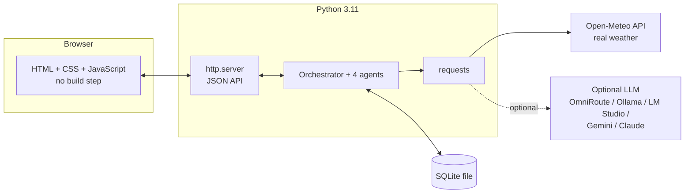

---

## 3. The 4 agents and the Orchestrator

There are **exactly 4 agents**. Each one has **one job**, like people in a team.

| # | Agent | Its job in simple words | Uses AI? |
|---|---|---|---|
| 1 | **Velloe Strategist** | Makes the plan: what to check, which data to get, and why | Optional |
| 2 | **Velloe Scout** | Gets the data. Tries again if a source fails, uses a backup copy if needed, and **never makes up data** | No (fixed rules) |
| 3 | **Velloe Intelligence** | Studies the data: finds patterns, lists possible reasons, picks the most likely one, suggests actions | Optional (only for wording) |
| 4 | **Velloe Guardian** | The strict checker. Approves or rejects the answer, and explains why | No (fixed rules) |

The **Orchestrator is not an agent**. It is the **manager**:

- It decides who works next.
- It passes work between agents.
- It stops things that run too long.
- It saves everything to the database.
- It handles human approval.

**Why 4 agents and not 1 big AI?** If one AI plans, collects, analyses and checks itself, mistakes are hidden. With separate jobs, every step can be seen, tested and blamed separately. Guardian can say "no" to Intelligence.

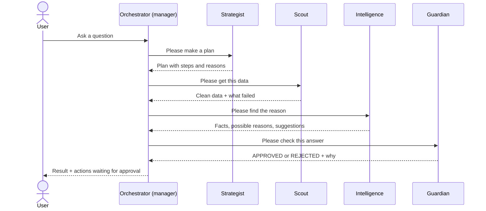

---

## 4. Big picture: system diagram

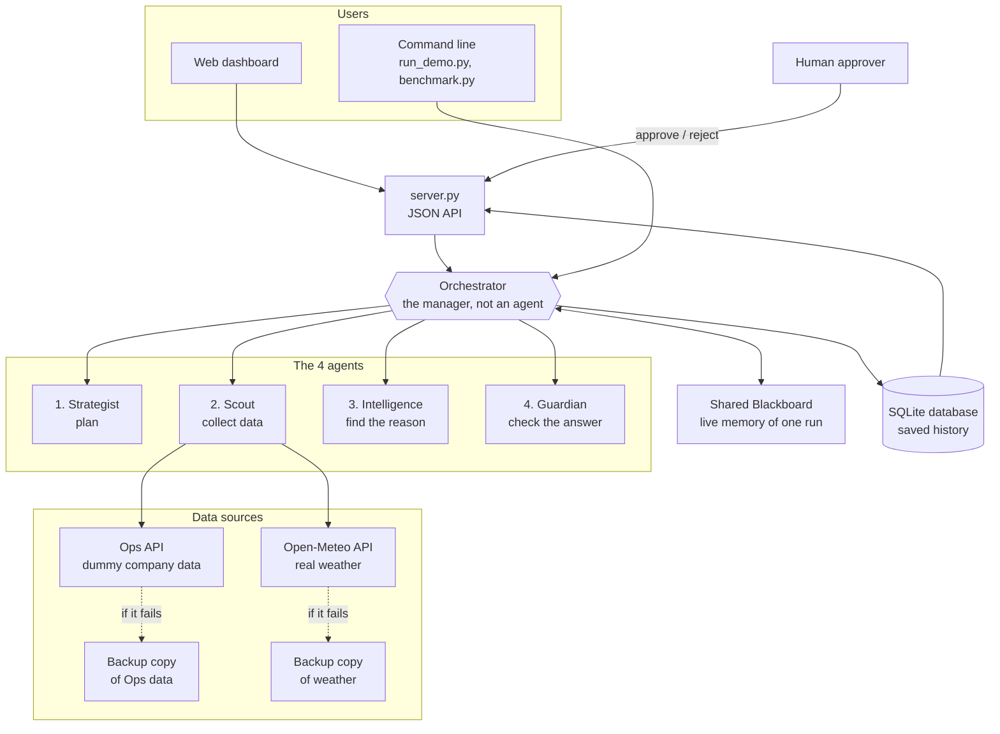

---

## 5. How one investigation works

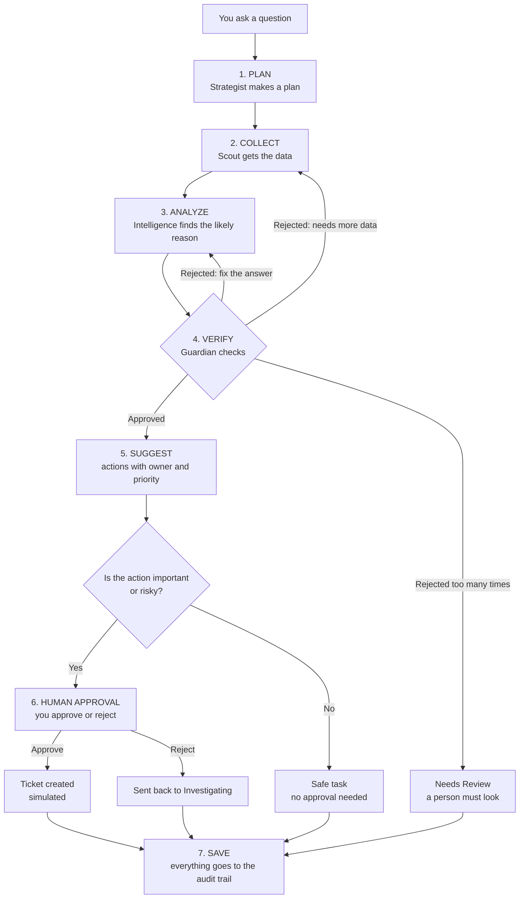

**The golden rule:** an important action can **only** reach a human **after** Guardian approves the answer. Nothing is done without a person saying yes.

---

## 6. Real example with real results

We ran the default demo (`python run_demo.py --scenario judge --approve y`) on **2026-09-26**:

| Step | What happened |
|---|---|
| 1. Plan | Strategist planned to look at incident records and outside weather |
| 2. Collect | The incident source was made to fail on purpose (error 500 → timeout → broken data). Scout tried 3 times, then used the **backup copy**: 11 incident records. The work continued |
| 3. Analyze | Intelligence found a repeated pattern of power problems around `UPS-A1` |
| 4. Verify | Guardian **REJECTED** the first answer: maintenance and diagnostic proof was missing |
| 5. More data | Strategist added one task; Scout collected 4 maintenance records (including `MNT-304`) |
| 6. Fix | Intelligence improved its answer (**1 revision**) |
| 7. Verify again | Guardian **APPROVED** |
| 8. Result | Most likely reason: **"Recurring upstream voltage instability affecting UPS-A1 at Site A"** at **70%**. "Internal fault in UPS-A1" dropped to 5% because the UPS self-test passed |
| 9. Suggest | **High** priority: *inspect the utility feed and ATS serving UPS-A1, keep UPS input logs, and check power quality before replacing UPS hardware* |
| 10. Human | Approved → simulated ticket **MT-0001** created |

The system does **not** say "the UPS is broken". The evidence points to the power coming **into** the UPS, so it says exactly that.

---

## 7. What happens when a data source fails

Scout never gives up on the first error, and never makes up data.

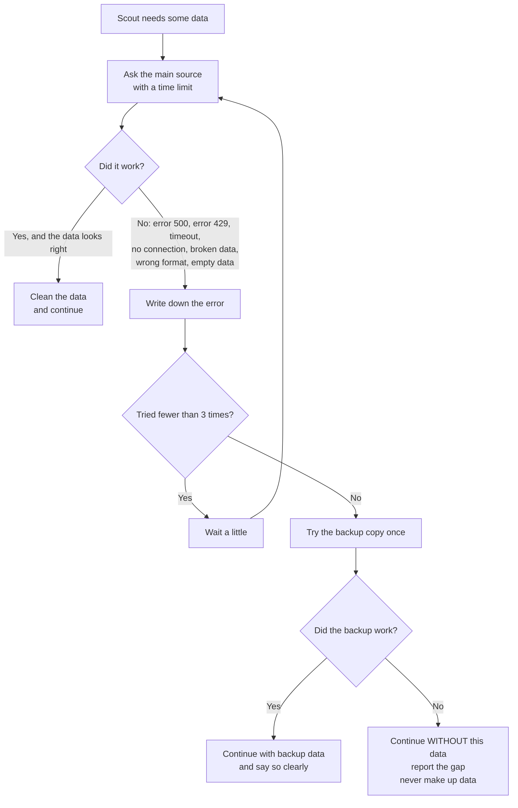

Errors it handles: **HTTP 500**, **HTTP 429** (too many requests; it waits at most 2 seconds), **timeout**, **no connection**, **broken JSON**, **wrong format**, and **empty data**.

You can test this yourself. The **New Investigation** window has a failure switch: **Normal, API 500, Timeout, Malformed Response, No Data**, plus extra demo modes.

---

## 8. How Guardian checks the answer

Guardian uses **fixed rules**, not AI, so it cannot be tricked by nice wording.

### 15 rules for a full investigation

| # | Rule in simple words |
|---|---|
| 1 | All parts are present: problem, facts, evidence, possible reasons, suggestions |
| 2 | There is matching evidence or a clear possible reason |
| 3 | Facts, evidence, guesses and suggestions are kept separate |
| 4 | Every record ID it mentions really exists in the collected data |
| 5 | Every medium or high-confidence reason has supporting evidence |
| 6 | No "definitely", "proven", "100%" style words for guesses |
| 7 | "Happened together" is not presented as "caused" |
| 8 | The summary points to real evidence |
| 9 | No confident reason is beaten by stronger opposing evidence |
| 10 | Fixing actions need at least **60%** confidence |
| 11 | Every action has an owner, an effort and a priority |
| 12 | Risky actions (replace, shut down, restart, roll back…) must need human approval |
| 13 | If important evidence can still be collected, go and get it first |
| 14 | Failed or backup sources are clearly mentioned |
| 15 | Missing data fields are clearly mentioned |

### 10 rules when you give Guardian your own written conclusion

Evidence must be given · no over-sure words · timing alone is not proof · saying a part is "broken" needs direct proof such as a self-test or logs · 3 or fewer events are too few to prove a cause · cited records must exist · no contradicting evidence · no risky action without approval · high confidence needs at least 3 pieces of evidence · weak sources must be mentioned.

**Example:**

```text
Claim:    "The UPS is definitely defective."
Evidence: UPS warnings came after power fluctuations.
Guardian: REJECTED — this only shows timing (correlation), not a real UPS fault.
Missing:  UPS self-test / diagnostic logs, power-quality measurements.
```

### What happens after a rejection

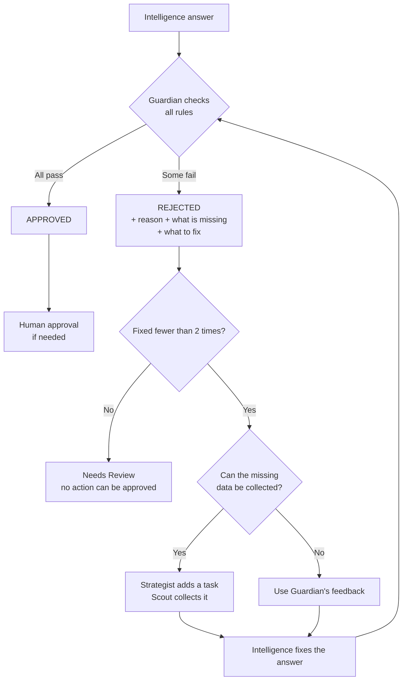

---

## 9. Safety limits

These stop the system from running forever or wasting money on AI calls. You can change them in `.env`.

| Setting | Default | What happens at the limit |
|---|---:|---|
| `MAX_WORKFLOW_STEPS` | 120 steps | Stops with **"STOPPED SAFELY"** and keeps what it found so far |
| `EXECUTION_TIMEOUT` | 300 seconds | Stops safely and keeps what it found so far |
| `MAX_TOOL_RETRIES` | 2 retries | After 3 tries, uses the backup copy once |
| `MAX_GUARDIAN_REVISIONS` | 2 fixes | Marked **Needs Review**; no action can be approved |
| `MAX_LLM_CALLS` | 12 calls | Stops safely (mock mode does not count) |
| `AGENT_TIMEOUT_SECONDS` | 60 seconds | A single-agent run is marked **Timeout** |
| `THERMAL_THRESHOLD_C` | 27 °C | Temperature above this counts as a problem |

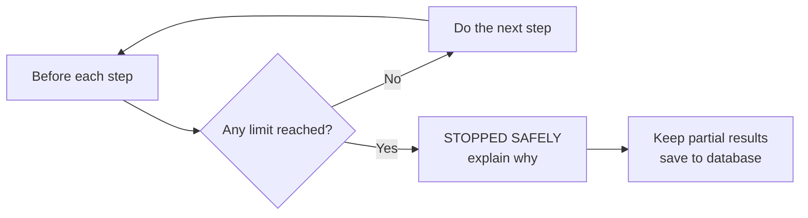

---

## 10. Human approval

Important actions **wait for you**. The investigation page has a **Your decision** box that shows up **only after Guardian approves**.

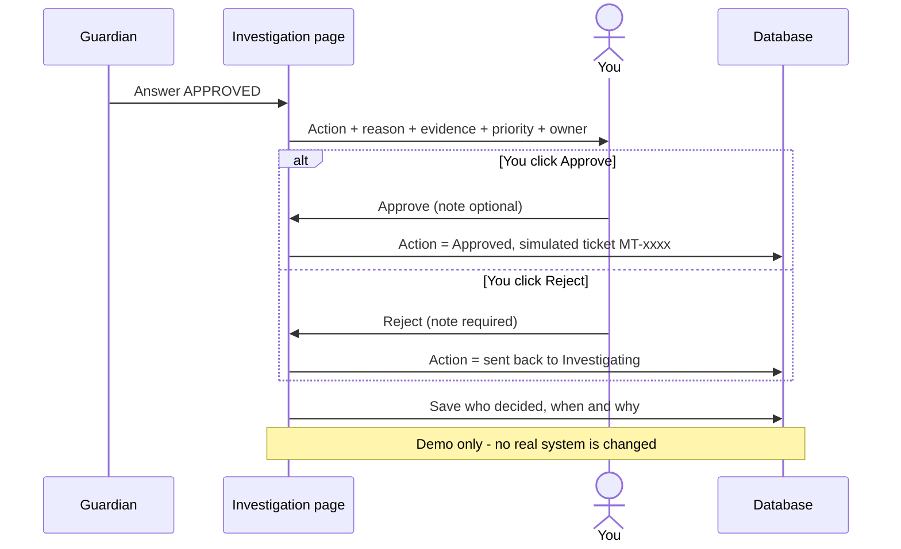

If Guardian did **not** approve, the box shows **"Human approval is locked"** and offers **Request More Evidence**.

### Action states on the Action Board

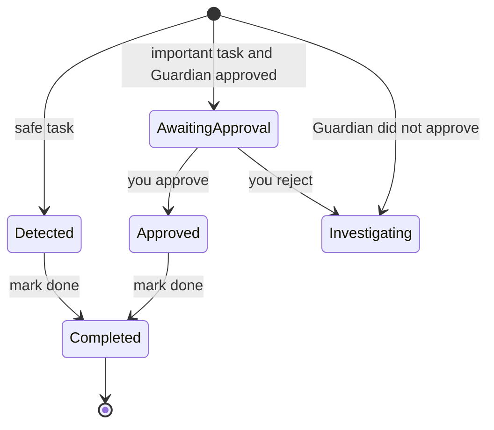

The approve step is saved as **one database transaction**. Either everything is saved or nothing is, and two people cannot approve the same action twice.

---

## 11. Two ways to use it

| Mode | What it does | When to use |
|---|---|---|
| **Full Investigation** (main mode) | All 4 agents work one after another automatically | Real questions such as "Why is this happening?" |
| **Individual Agent** | You run **just one** agent | Small jobs: "only make a plan", "only check this text" |

In Individual mode, **no other agent runs by itself**. You click a button to pass the work on: Strategist → Scout → Intelligence → Guardian. If Guardian rejects, you can click **Send for Revision**. If Guardian approves, you can click **Create Recommended Action**.

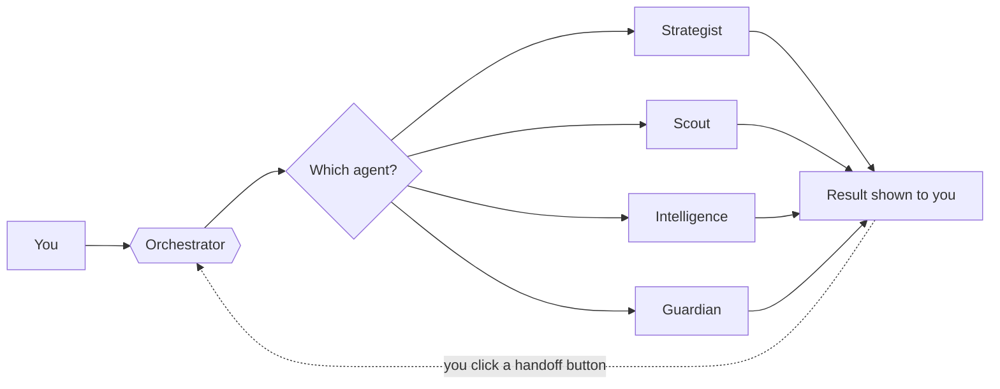

Both modes use the same safety limits, rules, database and audit trail.

---

## 12. Where data is saved

There are **two places**:

| Place | What it is | Lives for |
|---|---|---|
| **Shared Blackboard** (`blackboard.py`) | The **live memory** of one run: plan, data, facts, possible reasons, suggestions, Guardian result, budget | Only while the run is working |
| **SQLite database** (`store.py`, file `output/velloe_ops.db`) | The **saved history** of everything | Forever; survives restarts |

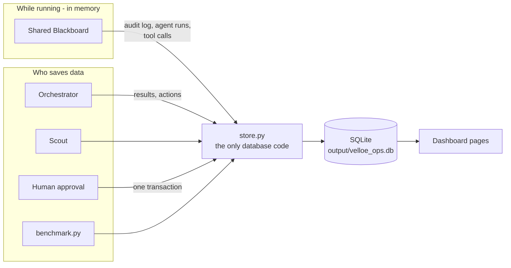

### The 12 database tables

| Table | What it stores (simple words) |
|---|---|
| `investigations` | One row per question you asked (or per single-agent run) |
| `incidents` | The list of known incidents, and which investigations used them |
| `events` | Every data record Scout collected |
| `agent_runs` | Every time an agent worked, and how long it took |
| `hypotheses` | The possible reasons, ranked |
| `evidence` | Facts for and against each possible reason, plus missing facts |
| `recommendations` | What Intelligence suggested, and Guardian's verdict on it |
| `actions` | Action Board items: status, approval and ticket |
| `approvals` | Who approved or rejected, when, and the note |
| `tool_executions` | Every data request: success, failure, retry, backup |
| `audit_logs` | The full diary: who did what, when and **why** |
| `benchmark_runs` | Results of each `python benchmark.py` run |

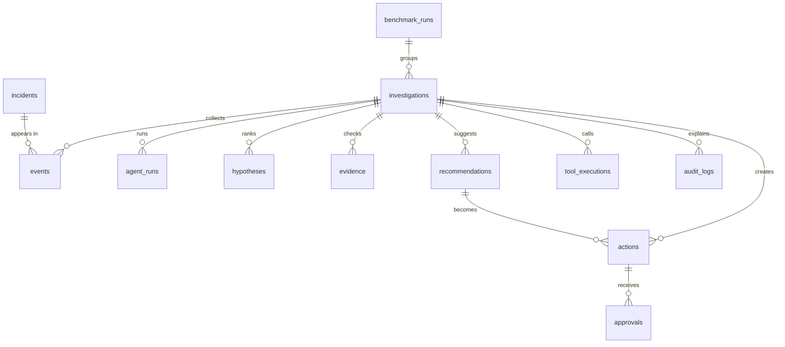

- `python store.py` shows the schema version and how many rows each table has.
- The database updates itself safely when the code adds new tables or columns. Old data is kept.

---

## 13. Real data vs dummy data

| Data | Real or dummy? | Where it comes from |
|---|---|---|
| Sites (Site A: Noida data centre, Site B: Gurugram edge site) | Dummy | `data/velloe_ops_snapshot.json` |
| Incidents (11), sensor readings (48), maintenance records (4) | Dummy | Same file, served through a pretend "Ops API" |
| Past weather | **Real** | Open-Meteo Archive API: `GET https://archive-api.open-meteo.com/v1/archive` |
| Weather backup copy | Saved real-style data | Same file, used if Open-Meteo fails |
| Tickets (`MT-xxxx`) | Simulated | Saved only in the local database |

The weather is used **only as background context**. It is never used as proof of an electrical problem.

---

## 14. Dashboard pages

Open <http://127.0.0.1:8000> after starting the server.

| Page | What you see |
|---|---|
| **Overview** | Key numbers, recent investigations, live activity, health of each part |
| **Investigations** | All questions asked. Open one to see:<br/>• **In simple words**: what happened, likely reason, suggestion, Guardian result, your next step<br/>• **What each agent did**: one box per agent with its numbers<br/>• **Your decision**: approve or reject, shown after Guardian approves<br/>• Full details: timeline, evidence, possible reasons, Guardian rules |
| **Action Board** | All actions as **Kanban cards** or a **table** |
| **Incidents** | Incident list from the database, and which investigations used each one |
| **Agents** | The 4 agents, their numbers, and a workspace to run one agent alone |
| **Audit Trail** | The full diary with search and filters (agent, mode, status, failures, dates) |
| **Analytics** | Success rates, Guardian rejections, tool health, benchmark results |
| **Settings** | Limits, AI provider test, light/dark theme, reset demo data |

---

## 15. Project structure

```text
velloe-multiagent/
├── agents/                    ← the 4 agents
│   ├── strategist.py          1. makes the plan
│   ├── scout.py               2. gets data (retry, backup, never makes up data)
│   ├── intelligence.py        3. finds patterns and the likely reason, suggests actions
│   └── guardian.py            4. checks the answer with fixed rules
├── tools/                     ← how Scout reaches data
│   ├── ops_api.py             pretend company "Ops API" + backup copy
│   ├── weather_tool.py        real Open-Meteo weather API + backup copy
│   └── faults.py              failure switch for demos (500, timeout, broken data…)
├── data/
│   └── velloe_ops_snapshot.json   dummy company data + saved weather
├── web/
│   ├── index.html             page layout and styles (light and dark theme)
│   └── app.js                 all dashboard pages (plain JavaScript)
├── tests/
│   └── test_core.py           73 automatic tests
├── orchestrator.py            the manager: order, limits, handoffs, human approval
├── blackboard.py              live memory of one run + audit diary + budget
├── store.py                   the only database code (SQLite tables, updates, saving)
├── server.py                  web server + JSON API
├── llm_client.py              optional AI connection (with backup provider)
├── config.py                  all settings and their default values
├── run_demo.py                run a demo from the command line
├── benchmark.py               fixed test scenarios + random failure test
├── requirements.txt           only "requests"
├── .env.example               example settings (copy to .env)
├── ARCHITECTURE.md            deeper technical design
├── ROADMAP.md                 what is done and what is next
└── PROJECT_MEMORY.md          notes for the team
```

`output/` is created when you run the app. It holds the database file and JSON trace copies.

---

## 16. How to run it

You need **Python 3.11 or newer**. Node.js is optional; it is only used to check JavaScript syntax.

### Windows PowerShell

```powershell
python -m venv .venv
.\.venv\Scripts\Activate.ps1
python -m pip install -r requirements.txt
python server.py
```

Then open <http://127.0.0.1:8000>.

- **No API key is needed.** By default it runs in mock mode.
- To use a real AI, copy `.env.example` to `.env` and fill in a provider.

### Useful commands

```powershell
python run_demo.py --scenario judge --approve y   # full power demo, auto-approve
python run_demo.py --failure api_500 --approve y  # demo with an API failure
python run_demo.py --scenario blackout            # every data source down
python benchmark.py                               # 8 fixed scenarios
python benchmark.py --suite random --n 6 --rate 0.5   # random failures
python store.py                                   # show database tables and row counts
python -m unittest discover -s tests -v           # run all tests
node --check web/app.js                           # check JavaScript syntax
```

Demo scenarios: `clean`, `demo`, `outage`, `judge`, `blackout`.

---

## 17. Settings

All settings live in `config.py` with safe default values. You can change them in `.env`; real environment variables win over `.env`.

| Setting | Default | Meaning |
|---|---|---|
| `MOCK_MODE` | `auto` | `auto` = use mock mode if no AI is set up, `on` = always mock, `off` = always real AI |
| `LLM_PROVIDER` | `auto` | `openai_compatible` or `anthropic` |
| `LLM_BASE_URL`, `LLM_MODEL`, `LLM_API_KEY` | empty | Main AI server |
| `LLM_FALLBACK_BASE_URL`, `LLM_FALLBACK_MODEL` | empty | Backup AI server (for example Gemini). If the main one fails, it tries this one |
| `LLM_COOLDOWN_SECONDS` | 120 | Skip a failed AI server for this long |
| `HOST`, `PORT` | `127.0.0.1`, `8000` | Where the dashboard runs |
| `DB_PATH` | `output/velloe_ops.db` | Database file |
| `DEMO_STEP_DELAY_SECONDS` | 0.25 | Small pause so you can watch agents work |

The safety limits are in [section 9](#9-safety-limits).

> Keep `.env` private. It can hold API keys. API keys are only sent in the request header and are never written to logs.

---

## 18. Tests and results

Checked on **2026-09-26**:

```text
python -m unittest discover -s tests   → Ran 73 tests ... OK
node --check web/app.js                → OK
python benchmark.py                    → 8/8 scenarios passed
```

The tests cover:

- all 4 agents, and making sure only 4 exist
- the real Open-Meteo response shape (tested without the internet)
- errors 500 and 429, timeout, broken data, wrong format, empty data, retries and backups
- Guardian rejecting, fixing and hitting the fix limit
- safe stopping at the limits
- human approval (approve, reject, no double approval, rollback on error)
- the database: all tables, safe updates of old files, data surviving a restart
- the Action Board, the Audit Trail and single-agent mode
- the "not enough evidence" case, and the full demo from start to end

The 8 benchmark scenarios are: normal, API failure, timeout, broken response, no data, Guardian rejection, the power demo, and safe stopping. These numbers come from **dummy data**, not a real company.

---

## 19. API list

All answers are JSON.

| Method | Path | What it does |
|---|---|---|
| GET | `/api/overview` | Dashboard numbers and health |
| GET | `/api/investigations` | List of investigations |
| GET | `/api/investigations/{id}` | One investigation: result, agents, actions, approvals, audit |
| POST | `/api/investigations` | Start an investigation `{question, failure}` |
| POST | `/api/investigations/{id}/more-evidence` | Collect more data and run again |
| POST | `/api/agents/{agent}/run` | Run one agent alone |
| GET | `/api/executions`, `/api/executions/{id}` | Single-agent runs |
| POST | `/api/executions/{id}/handoff` | Pass work to the next agent |
| GET | `/api/actions` | Action Board |
| POST | `/api/actions/{id}/approve` · `reject` · `complete` | Human decision |
| GET | `/api/approvals` | Approval history |
| GET | `/api/audit` | Audit Trail with filters |
| GET | `/api/incidents` | Incident list |
| GET | `/api/agents`, `/api/analytics`, `/api/benchmarks` | Agent numbers, charts, benchmark history |
| GET | `/api/settings`, `/api/sites`, `/api/database` | Settings, sites, database info |
| POST | `/api/llm/test` | Test the AI connection |
| POST | `/api/reset` | Delete demo data (needs `{"confirm": "RESET"}`) |

> ⚠️ **There is no login.** The server only listens on your own computer (`127.0.0.1`). Do not put it on the internet as it is.

---

## 20. What it cannot do yet

- **No login or user roles.** The approver name is a demo value.
- **Company data is dummy.** Only the weather API is real.
- **Rules are general.** Guardian rules and the 27 °C limit are the same for every site. They are not tuned for a real company, and they cannot be changed from the dashboard.
- **Time limits cannot kill a stuck task.** Python cannot force-stop a thread, so the system stops waiting and ignores the late result.
- **Guardian checks words and evidence links.** It does not truly "understand" every sentence.
- **"Request More Evidence" replaces old results.** It overwrites the old results of the same investigation instead of making a new copy.
- **Not connected to real tools yet.** There is no real ticket system or real building sensors.

See [ROADMAP.md](ROADMAP.md) for what comes next.

---

## 21. Simple meaning of hard words

| Word | Simple meaning |
|---|---|
| **Agent** | A helper program with one job |
| **Orchestrator** | The manager that tells the agents what to do and in what order |
| **Blackboard** | Shared live memory that all agents use during one run |
| **Hypothesis** | A possible reason ("maybe this caused it") |
| **Evidence** | A fact from the data that supports or goes against a reason |
| **Confidence** | How sure the system is, as a score out of 100. It is not a true probability |
| **Correlation vs causation** | "Happened at the same time" is not the same as "caused it" |
| **Fallback / backup copy** | A second data source used when the main one fails |
| **Retry** | Trying the same request again after a short wait |
| **Guardian verdict** | Guardian's final answer: APPROVED or REJECTED |
| **Revision** | Intelligence fixing its answer after Guardian's feedback |
| **Human approval** | A real person must say yes before an important action |
| **Audit trail** | A diary of every step: who, what, when and why |
| **Mock mode** | Running without a real AI; same result every time |
| **Transaction** | Saving several things together: all of them or none |
| **Benchmark** | A fixed set of test runs to measure how well the system works |
